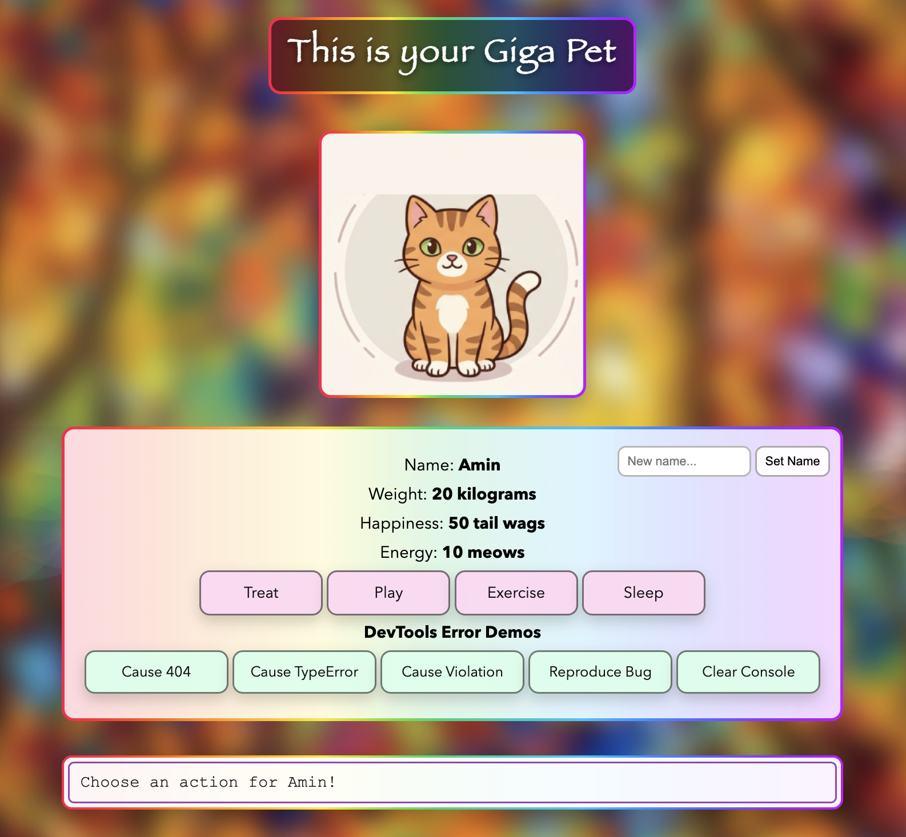

Project 2.

GitHub Pages: https://adamurban04.github.io/comp484-project2v2-main-main/

## What I added
- `pet_info` object with stats (**name, weight, happiness, energy**) and UI updates
- Action behaviors for **Treat / Play / Exercise** + a new action: **Sleep**
- Safety checks so stats **can’t go below 0**
- On-page visual notification
- Two unique jQuery methods used and explained in code:
  - **`.closest()`** for reliable button click handling
  - **`.animate()`** for sprite bounce + message fade-in effect
- **Rename feature** (set a new pet name from the input)
- **Sprite moods** (neutral/treat/play/exercise/sleep + tired when stats are critical)
- **Sound effects** for actions (in `/sounds`)
- Custom styling: centered layout, background image, rainbow-ish borders, button styling

## DevTools Homework Additions
Added simple Chrome DevTools demo triggers to satisfy the homework requirements:
- Console logging demos: `log`, `info`, `warn`, `error`, `table`, `group`, custom styled log
- Error/Network demos: 404 request, uncaught TypeError, long-task Violation
- Filtering demos: predictable console messages for filtering by level/text/regex/source/user messages
- Sources debugging demo: “Reproduce Bug” + breakpoint/watch/scope + apply a fix

### PDF (screenshots + implementation details)
- [Open the PDF report](assets/examples.pdf)

## Assets
- Images: `/images` (including `background.jpg` and the mood sprites)
- Sounds: `/sounds` (mp3 files used by the action buttons)
- DevTools PDF: [`assets/examples.pdf`](assets/examples.pdf)

  

